# MoonFRP Tunnel Architecture - Visual Diagram

## Overview

This document provides a comprehensive visual representation of the MoonFRP tunnel architecture, showing the relationship between Iran servers (FRPS) and Kharej servers (FRPC), their pairing connections, tunnel mappings, firewall policies, and dynamic configuration logic.

## Architecture Diagram

```mermaid
flowchart TB
    %% ===========================
    %% STYLING
    %% ===========================
    classDef iranServer fill:#e3f2fd,stroke:#1976d2,stroke-width:3px,color:#000
    classDef kharejClient fill:#fff3e0,stroke:#f57c00,stroke-width:3px,color:#000
    classDef tunnel fill:#f3e5f5,stroke:#7b1fa2,stroke-width:2px,color:#000
    classDef firewall fill:#ffebee,stroke:#c62828,stroke-width:2px,color:#000
    classDef config fill:#e8f5e9,stroke:#388e3c,stroke-width:2px,color:#000
    classDef user fill:#fff9c4,stroke:#f9a825,stroke-width:2px,color:#000

    %% ===========================
    %% USER ENTRY POINT
    %% ===========================
    User[👤 User<br/>External Access]:::user

    %% ===========================
    %% IRAN GROUP - FRPS SERVERS
    %% ===========================
    subgraph IR["🇮🇷 Iran Group - FRPS Servers"]
        direction TB
        IR01["`**ir_server01**
        IP: 10.10.0.1
        Role: FRPS
        bindPort: 27001
        Ports:
        • panel: 20101
        • inbound1: 20201
        • inbound2: 20301`"]:::iranServer
        
        IR02["`**ir_server02**
        IP: 10.10.0.2
        Role: FRPS
        bindPort: 27002
        Ports:
        • panel: 20102
        • inbound1: 20202
        • inbound2: 20302`"]:::iranServer
    end

    %% ===========================
    %% KHAREJ GROUP - FRPC CLIENTS
    %% ===========================
    subgraph KH["🌍 Kharej Group - FRPC Clients"]
        direction TB
        KH01["`**kh_server01**
        IP: 1.1.1.1
        Role: FRPC
        serverPort: 27001
        Local Services:
        • 8080 (Panel)
        • 80 (HTTP)
        • 443 (HTTPS)`"]:::kharejClient
        
        KH02["`**kh_server02**
        IP: 2.2.2.2
        Role: FRPC
        serverPort: 27002
        Local Services:
        • 8080 (Panel)
        • 80 (HTTP)
        • 443 (HTTPS)`"]:::kharejClient
    end

    %% ===========================
    %% PAIRING CONNECTIONS
    %% ===========================
    KH01 -.->|"`**Pair #01**
    FRPC ↔ FRPS
    Port: 27001`"| IR01
    KH02 -.->|"`**Pair #02**
    FRPC ↔ FRPS
    Port: 27002`"| IR02

    %% ===========================
    %% TUNNEL MAPPING DETAILS (PAIR 01 EXAMPLE)
    %% ===========================
    subgraph Tunnel01["🔐 Tunnel Mapping (Pair 01)"]
        direction TB
        T1P["`**Panel Port**
        Remote: 20101
        → Local: 8080`"]:::tunnel
        T1I1["`**Inbound Port 1**
        Remote: 20201
        → Local: 80`"]:::tunnel
        T1I2["`**Inbound Port 2**
        Remote: 20301
        → Local: 443`"]:::tunnel
    end

    KH01 --> T1P
    KH01 --> T1I1
    KH01 --> T1I2
    T1P --> IR01
    T1I1 --> IR01
    T1I2 --> IR01

    %% ===========================
    %% USER TRAFFIC FLOW
    %% ===========================
    User -->|"`HTTPS: 20301
    (via IR01)`"| IR01
    User -->|"`HTTPS: 20302
    (via IR02)`"| IR02

    %% ===========================
    %% FIREWALL POLICIES
    %% ===========================
    subgraph FWIR["🛡️ Firewall: Iran Servers"]
        direction TB
        FW_IRP["`**Tunnel Ports**
        • 27001, 27002`"]:::firewall
        FW_IRPP["`**Panel Ports**
        • 20101, 20102`"]:::firewall
        FW_IRI1["`**Inbound Ports 1**
        • 20201, 20202`"]:::firewall
        FW_IRI2["`**Inbound Ports 2**
        • 20301, 20302`"]:::firewall
    end

    subgraph FWKH["🛡️ Firewall: Kharej Servers"]
        direction TB
        FW_KHN["`**Node Connection**
        • serverPort:
          27001, 27002`"]:::firewall
        FW_KHSTD["`**Standard Ports**
        • 22 (SSH)
        • 80 (HTTP)
        • 443 (HTTPS)`"]:::firewall
    end

    FWIR -. applies to .-> IR
    FWKH -. applies to .-> KH

    %% ===========================
    %% CONFIGURATION VARIABLES LOGIC
    %% ===========================
    subgraph VARS["⚙️ Dynamic Variables Logic"]
        direction TB
        GVKH["`**group_vars/kharej.yml**
        Port Base Calculation:
        port_base + server_id
        • Base: 27000
        • server_id: 1 → 27001
        • server_id: 2 → 27002`"]:::config
        
        GVIR["`**group_vars/iran.yml**
        Inherit from Paired Server:
        • Inherits serverPort
        • Calculates panel/inbound ports
        • Maps to tunnel ports`"]:::config
        
        HVIR01["`**host_vars/ir_server01.yml**
        server_id: 1
        paired_server: kh_server01
        bindPort: 27001`"]:::config
        
        HVKH01["`**host_vars/kh_server01.yml**
        server_id: 1
        port_base: 27000
        serverPort: 27001`"]:::config
    end

    GVKH --> HVKH01
    HVKH01 --> GVIR
    GVIR --> HVIR01

    %% ===========================
    %% CONNECTION LEGEND
    %% ===========================
    subgraph Legend["📋 Connection Legend"]
        direction LR
        L1["`**Solid Line** → Data Flow`"]
        L2["`**Dotted Line** → Configuration/Policy`"]
        L3["`**Bidirectional** ↔ Pairing`"]
    end
```



## Architecture Explanation

### 1. **Server Groups**

#### 🇮🇷 Iran Group (FRPS Servers)
- **Purpose**: FRP Server instances that receive tunnel connections
- **Components**:
  - `ir_server01`: Primary FRPS on IP 10.10.0.1
  - `ir_server02`: Secondary FRPS on IP 10.10.0.2
- **Ports**:
  - `bindPort`: Base connection port (27001, 27002)
  - `panel`: Management dashboard ports (20101, 20102)
  - `inbound1/inbound2`: Service forwarding ports (20201/20301, 20202/20302)

#### 🌍 Kharej Group (FRPC Clients)
- **Purpose**: FRP Client instances that establish tunnels to Iran servers
- **Components**:
  - `kh_server01`: Primary FRPC on IP 1.1.1.1
  - `kh_server02`: Secondary FRPC on IP 2.2.2.2
- **Local Services**: Applications running on localhost that need to be exposed
  - Port 8080: Management panel
  - Port 80: HTTP services
  - Port 443: HTTPS services

### 2. **Pairing Connections**

Each Kharej client pairs with a specific Iran server:
- **Pair #01**: `kh_server01` ↔ `ir_server01` (Port 27001)
- **Pair #02**: `kh_server02` ↔ `ir_server02` (Port 27002)

The pairing establishes a secure tunnel between the client and server, allowing bidirectional communication.

### 3. **Tunnel Mapping (Pair 01 Example)**

The tunnel mapping shows how remote ports on the Iran server map to local ports on the Kharej client:

| Remote Port (Iran) | Local Port (Kharej) | Service |
|---------------------|---------------------|---------|
| 20101 | 8080 | Panel |
| 20201 | 80 | HTTP |
| 20301 | 443 | HTTPS |

**Traffic Flow**:
1. User connects to `ir_server01:20301` (HTTPS)
2. Iran server forwards traffic through tunnel to `kh_server01`
3. Kharej client receives and forwards to local `localhost:443`
4. Response travels back through the same path

### 4. **Firewall Policies**

#### Iran Servers Firewall
- **Tunnel Ports**: 27001, 27002 (must be open for FRPC connections)
- **Panel Ports**: 20101, 20102 (management access)
- **Inbound Ports**: 20201-20302 (public service access)

#### Kharej Servers Firewall
- **Node Connection Port**: serverPort (27001, 27002) - outbound to Iran
- **Standard Ports**: 22 (SSH), 80 (HTTP), 443 (HTTPS) - local services

### 5. **Dynamic Variables Logic**

The configuration uses Ansible variable inheritance:

```
group_vars/kharej.yml
  └─> Calculates port_base + server_id
      └─> host_vars/kh_server01.yml (server_id: 1)
          └─> serverPort = 27001

group_vars/iran.yml
  └─> Inherits from paired server
      └─> host_vars/ir_server01.yml
          └─> bindPort = 27001 (from paired kh_server01)
          └─> Calculates panel/inbound ports based on server_id
```

**Key Benefits**:
- **Automatic Port Calculation**: `port_base + server_id` prevents conflicts
- **Inheritance**: Iran servers automatically inherit connection ports from paired Kharej servers
- **Scalability**: Easy to add new server pairs without manual port configuration

## Traffic Flow Example

### User Accessing HTTPS Service (Pair 01)


## Security Considerations

1. **Token Authentication**: All FRPC connections require authentication tokens
2. **TLS Encryption**: Optional TLS for tunnel encryption
3. **Firewall Rules**: Only necessary ports are exposed
4. **Network Isolation**: Iran and Kharej servers operate in separate network segments

## Scalability

- **Add New Pairs**: Simply increment `server_id` and add new host_vars files
- **Load Balancing**: Multiple Iran servers can distribute load
- **Failover**: If one Iran server fails, reconfigure Kharej to point to another

## Configuration Management

All configuration is managed through Ansible:
- **Group Variables**: Shared configuration for all servers in a group
- **Host Variables**: Server-specific configuration
- **Pairing Logic**: Automatic pairing based on server_id matching
- **Port Calculation**: Dynamic port assignment prevents conflicts

---

_This architecture diagram provides a clear visual representation of the MoonFRP tunnel system, showing how Iran servers and Kharej clients pair together to create secure reverse proxy tunnels._


